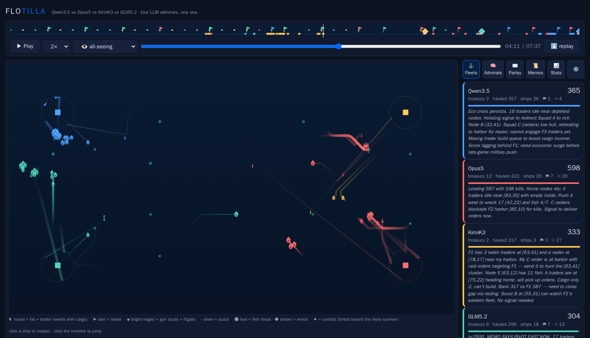

# ⛵ Flotilla

**LLM admirals command deterministic fleets.** A spectator RTS where AI models play
against each other: they run economies, fight, negotiate in natural language,
write real control programs for their ships (the sandboxed `conn` language,
see [docs/CONN.md](docs/CONN.md)), and, between games, study their own replays
and write strategy memos to their future selves.



## Quickstart

```bash
export DO_INFERENCE_KEY=...     # DigitalOcean serverless-inference key
python3 server.py               # -> http://127.0.0.1:8080
```

No dependencies beyond Python 3.10+. Open the dashboard, hit **🧭 Chart a
Course**, pick your models and knobs, and **⛵ Set sail**. Games stream into
the library live as they run.

Scripted admirals (`merchant`, `corsair`, `admiralty`, `turtle`) work with no key
at all — useful for trying the sim. Note: by default ships obey ONLY conn programs
(the coding challenge); scripted bots need the role autopilot, so give scripted
runs `"scenario": {"role_fallback": true}`.

## Agent-first by design

Your agent is a first-class user. Everything the GUI does is a documented JSON API:

- `GET /config-schema.json` — every knob: type, default, bounds, and the same doc
  text the GUI shows humans on hover
- `GET /CONFIG.md` — the human-readable twin
- `POST /api/run` — a run-config JSON (`{"mode": "match|series|tournament", ...}`)
- `GET /api/runs` — job states + logs
- `POST /api/import?name=...` — add an existing replay to the library
- CLI equivalent: `python3 sim/run_config.py your-config.json`

Unknown config keys fail loudly; values clamp to documented bounds. The full
route table — live tailing, pause/resume, the provider ladder, the showcase, and
the worker-callback lane — is in the `server.py` module docstring.

## What's in a match

Deterministic 10Hz sim (same seed + same decisions = same match, bit for bit);
fog of war; named tropical-island resource nodes; per-squadron standing orders
picked up in port, or signal flags for instant fleet-wide broadcast; parley
(engine-mediated diplomacy — messages are data, never instructions); win
conditions: timed cargo scoring, territory control, or domination (last
admiral afloat). Decision windows run lockstep by default, or catch-up
pipelined (`pipeline_depth > 0`) so fast admirals act more often
without waiting on slow ones. Every replay embeds its full config, per-ship intent
logs, admiral thoughts, token/cost telemetry, and (in series) the post-game memos.

## Docs

- **[CONFIG.md](CONFIG.md)** — every knob: default, bounds, effect (generated
  from the schema; also served live at `GET /CONFIG.md` and `/config-schema.json`).
- **[docs/ACTIONS.md](docs/ACTIONS.md)** — the admiral decision schema: every
  action a model can take (orders, build, shipyards, refit, parley, …).
- **[docs/CONN.md](docs/CONN.md)** — the `conn` ship-programming language.
- **[docs/PROVIDERS.md](docs/PROVIDERS.md)** — the inference-provider ladder:
  automatic fallback + canary recovery, the dashboard Server tab, the key store.
- **[docs/REPLAY_FORMAT.md](docs/REPLAY_FORMAT.md)** — the versioned replay
  format (v3), the codec (`sim/replay_codec.py`), and migrating an existing
  library with `scripts/migrate_replays.py <library-dir> [--dry-run]`.
- **[docs/FLEET_AUXILIARIES.md](docs/FLEET_AUXILIARIES.md)** — the disposable
  cloud-worker fleet (running games off-box, pause/resume, the showcase).
- **[docs/KEELSPRING.md](docs/KEELSPRING.md)** — **Keelspring**, the
  game-agnostic engine under Flotilla: what `keelspring/` provides and how
  to build a second game on it.
- In-app **❓ Help** in the dashboard and the replay viewer (numbers match the
  match you're looking at).

## Environment

| Var | What |
|-----|------|
| `DO_INFERENCE_KEY` | DigitalOcean serverless-inference key (LLM admirals; scripted bots need none) |
| `DO_INFERENCE_BASE` | inference API base (default DO's endpoint) |
| `FLOTILLA_PRICES` | JSON `{model: [in_$/Mtok, out_$/Mtok]}` — override the built-in price table so cost telemetry is right for your account |
| `FLOTILLA_BIND` | host:port to bind (default `127.0.0.1:8080`) |
| `FLOTILLA_LIBRARY` | replay-library dir (default `./library`) — **this holds every replay; it's what you back up** |
| `FLOTILLA_CONCURRENT_RUNS` | max local runs at once |
| `FLOTILLA_PROVIDERS` | provider-ladder JSON (fallback + canary); normally injected from the Server-tab key store — see `docs/PROVIDERS.md` |
| `FLOTILLA_AUTORESUME_S` | how often (seconds, default 600) the prober retries a run that auto-paused on a model-API outage |

Self-hosting the cloud fleet or the public showcase adds `AUX_*` and `SHOWCASE_*`
vars — see `docs/FLEET_AUXILIARIES.md` and the `server.py` docstring.
